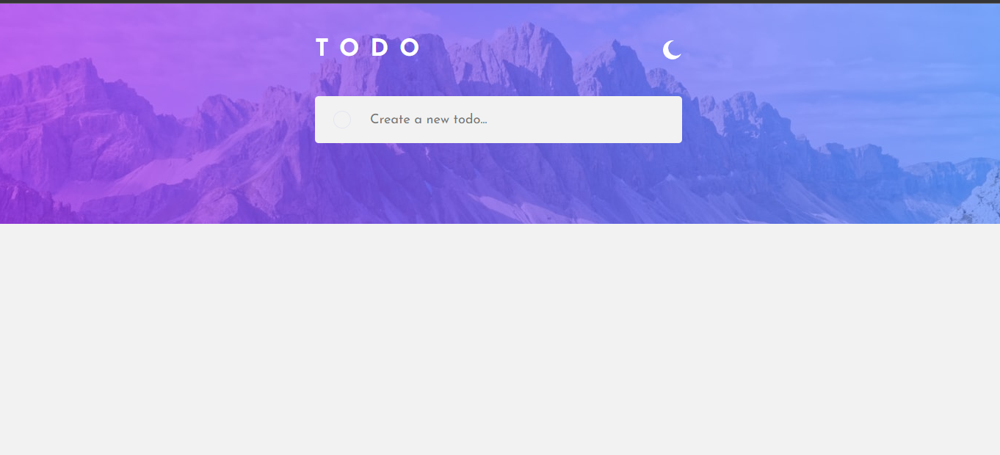
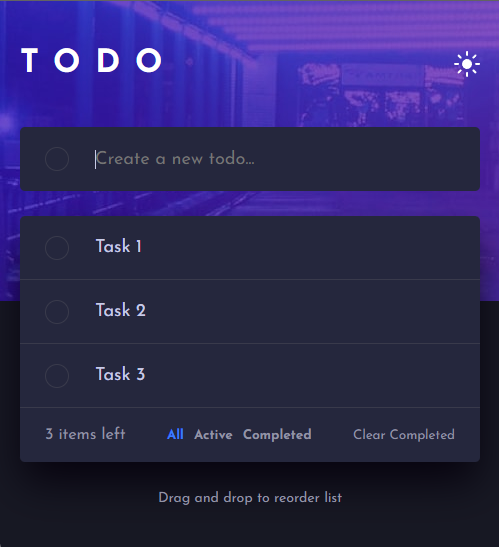

# Frontend Mentor - Todo app solution

This is a solution to the [Todo app challenge on Frontend Mentor](https://www.frontendmentor.io/challenges/todo-app-Su1_KokOW). Frontend Mentor challenges help you improve your coding skills by building realistic projects.

## Table of contents

- [Overview](#overview)
  - [The challenge](#the-challenge)
  - [Screenshot](#screenshot)
  - [Links](#links)
- [My process](#my-process)
  - [Built with](#built-with)
  - [What's pending](#what-i-learned)
- [Author](#author)

## Overview

### The challenge

Users should be able to:

- View the optimal layout for the app depending on their device's screen size
- See hover states for all interactive elements on the page
- Add new todos to the list
- Mark todos as complete
- Delete todos from the list
- Filter by all/active/complete todos
- Clear all completed todos
- Toggle light and dark mode
- **Bonus**: Drag and drop to reorder items on the list

### Screenshot

### Links

- Solution URL: [Add solution URL here](https://github.com/BauTancredi/todo-app)
- Live Site URL: [Add live site URL here](https://bautancredi.github.io/todo-app/)

## My process

### Built with

- [React](https://reactjs.org/) - JS library

### What's pending

- Firebase
- Move theme context to its own file
- Drag and drop in filters

## Author

- Website - [Add your name here](https://www.bautista-tancredi.com)
- Frontend Mentor - [@yourusername](https://www.frontendmentor.io/profile/BauTancredi)
